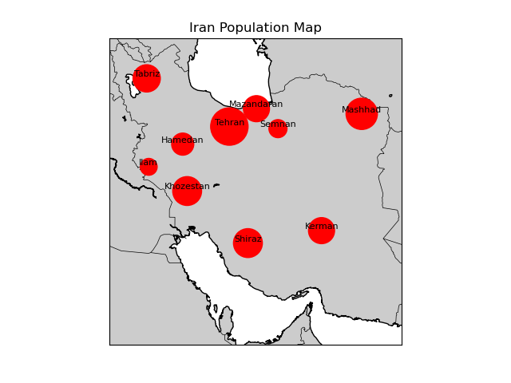

# 📍 Iran Population Visualization with Basemap

This project visualizes the population data of 10 Iranian cities on a geographic map using **Matplotlib's Basemap**. The city coordinates are provided in DMS format and are converted to decimal degrees before mapping.

---

## 📁 Project Structure

```
.
├── main.py                   # Main script to plot the map
├── ExtractData.py           # Extracts and preprocesses data from CSV
├── ConvertToCoordinate.py   # Converts DMS coordinates to decimal and Mercator projection
├── iran.csv                 # Input data: city names, coordinates, and populations
├── environment.yml          # Conda environment setup file
├── Figure_1.png             # Output map image
└── README.md                # Project documentation
```

---

## 🧠 Features

- Reads geographical and population data of 10 Iranian cities from a CSV file
- Converts coordinates from DMS (Degrees, Minutes, Seconds) to decimal degrees
- Plots the cities on a **Basemap Mercator projection** of Iran
- **Visualizes population density** by adjusting the size of red circles for each city
- Annotates city names on the map for easy identification

---

## ⚙️ Python Version Note

Although I usually work with **Python 3.13**, I had to switch to using **Anaconda** for this project because the **Basemap** library is not supported in Python 3.13. This project runs in a conda environment configured for **Python 3.9**.

---

## 📦 Requirements

Use the provided `environment.yml` to install dependencies via conda:

```bash
conda env create -f environment.yml
conda activate basemap_env
```

Dependencies include:

- Python 3.9
- Basemap and Basemap High-Resolution data
- Matplotlib
- Pandas
- NumPy

---

## 🚀 How to Run

Once the environment is set up:

```bash
python main.py
```

A map of Iran will appear with 10 cities plotted. The size of each **red dot represents the city’s population**, making it easy to spot **more densely populated areas**.

---

## 📄 CSV File Structure (`iran.csv`)

| City     | Latitude           | Longitude          | Population |
|----------|--------------------|--------------------|------------|
| Tehran   | 35° 41' 46"        | 51° 25' 23"        | 8846782    |
| ...      | ...                | ...                | ...        |

> ⚠️ Note: The coordinate format must be DMS (e.g., `35° 41' 46"`), and the file must be UTF-8 encoded.

---

## 🖼️ Sample Output

Each city is displayed as a **red circle** on the map. The **larger the circle, the higher the population** of that city. This helps quickly identify **regions with higher population density** across Iran.



---

## 📝 License

Feel free to use, share, and modify this project. No license restrictions are applied unless added explicitly.